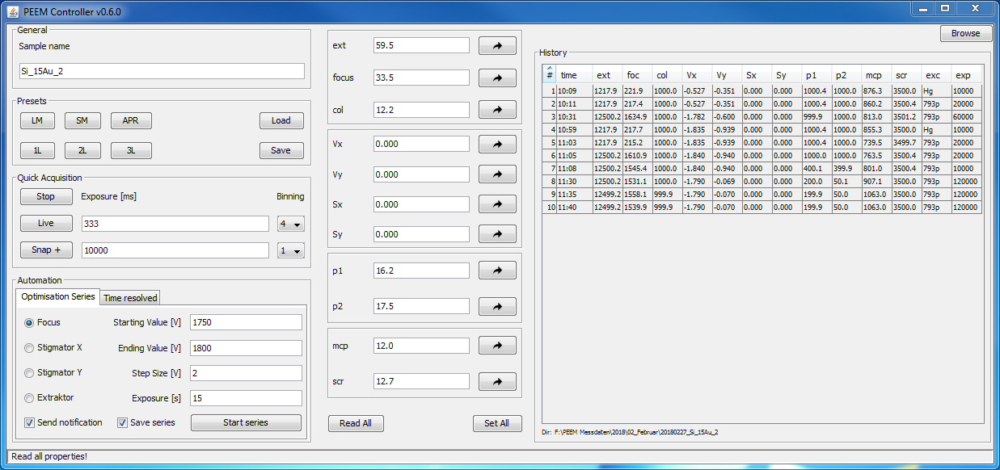
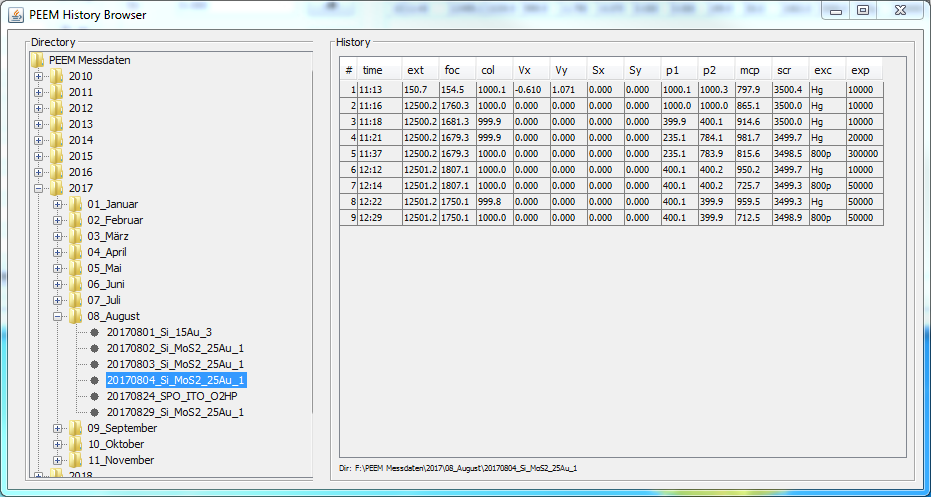
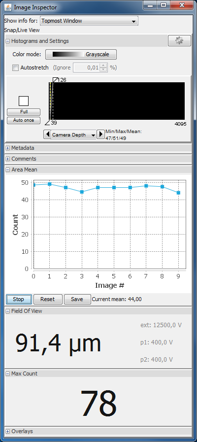
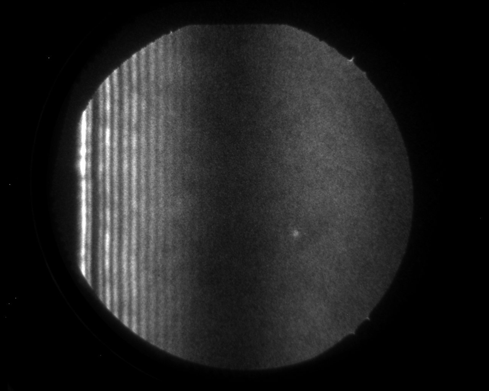

# PEEM-Controller

## What is it?

This repo holds four [Micro-Manager 2.0](https://micro-manager.org/) plugins to control and monitor a **P**hoto **E**mission **E**lectron **M**icroscope ([PEEM](https://en.wikipedia.org/wiki/Photoemission_electron_microscopy))
in conjunction with an image acquisition system and an interferometric delay stage.

## Features

### Main program

* Simple image acquistion with reasonable default values for exposure and binning. Images are saved to a hard coded predefined folder structure. PEEM parameters are saved besides the image file
* Preset management allows to save a set of PEEM parameters to recall it at a later stage or to switch between two zoom settings quickly
* Optimisation series sweep through a single PEEM parameter while holding the remaining parameters constant. After the series has finished you can select the best fitting parameter which gives the sharpest image
* The panel in the middle is more or less a substitute for the hardware interface of the microscope. You can set single or all PEEM parameters or read out the PEEMs current state
* The history table lists the last acquisitions with their corresponding PEEM parameters. A double click loads the parameters to the middle panel. They are then ready to be sent to the PEEM to retake an image
* The browse button in the top right corner lets you view measurements from the past. If you took a picture of a sample a week ago and want to see the parameters you can browse through the history. See the following screenshot:

  

### Inspector panels

In the following screenshot you can see the inspector panel which shows meta information for the current image. There are three panels opened up which are part of PEEM-Controller. Namely

1. Area Mean
2. Field Of View
3. Max Count

#### Area Mean

The area mean inspector plugin shows the average pixel value of a region of interest or if none exists the whole image over time. You can start/stop the mean calculation, reset it or save its values to a text file for further analyses. The graph is plotted with the free library [JFreeChart](http://www.jfree.org/jfreechart/). This is useful for keeping track of the transient of a time resolved measurement with the delay stage.

#### Field of view

You can see a typical PEEM image down below. It has a circular field of view whereas the dimension can be approximated via the PEEM parameters of both projectives and the extractor. In case of the screenshot the field of view (diameter of the circle) amounts to `91.4 µm`.

#### Max count

The max count plugin looks at every pixel of the image and returns prints the overall highest value to the screen. In the screenshot under `Histogram and Settings` you can see values for min/max/mean. This plugin just magnifies the middle value to be easily visible from the distance.

## Technical details

PEEM-Controller is solely written in `Java`. It communicates via `RS232` with the microscope and over `TCP/IP` with the delay stage. All the panels you see in the above screenshot are independent modules. However, from time to time they need to communicate with each other. This is done via the [observer pattern](https://en.wikipedia.org/wiki/Observer_pattern). I tried to comply to the [single responsibility principle](https://en.wikipedia.org/wiki/Single_responsibility_principle) and [inject dependencies](https://en.wikipedia.org/wiki/Dependency_injection) as often as possible. In general [SOLID principles](<https://en.wikipedia.org/wiki/SOLID_(object-oriented_design)>) are your friend.

## Development

You need the following items in your Java class path:

* projects `lib` directory. This dir contains a 64-bit version of the RxTx serial communication
  library ([link](http://rxtx.qbang.org/wiki/index.php/Download))
* `ij.jar` (inside the Micro-Manager 2.0 installation folder)
* `plugins/Micro-Manager` directory (inside the Micro-Manager 2.0 installation folder)

Use Java 1.8 and install all Maven dependencies.

Have a look at the `ConstantsExample.java` file, rename it to `Constants.java` and adapt it to your local setup.

In order to run the plugin together with Micro-Manager 2.0 you need to run `ij.ImageJ` as the main
class (in IntelliJ). Micro-Manager will automatically find your plugin.

After you've built an artifact of this plugin you'll need to place it in the `mmplugins` directory
inside the Micro-Manager 2.0 installation folder).

## What's it for?

This tool makes it easier to take images like this:

If you want to have a look at images and videos of a time resolved measurement visit [AG Bauer](https://www.physik.uni-kiel.de/en/institutes/bauer-group/research/ultrafast-plasmonics?set_language=en).

# License

[MIT](LICENSE)
